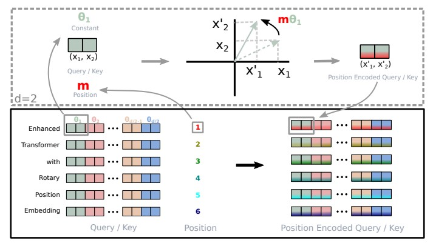
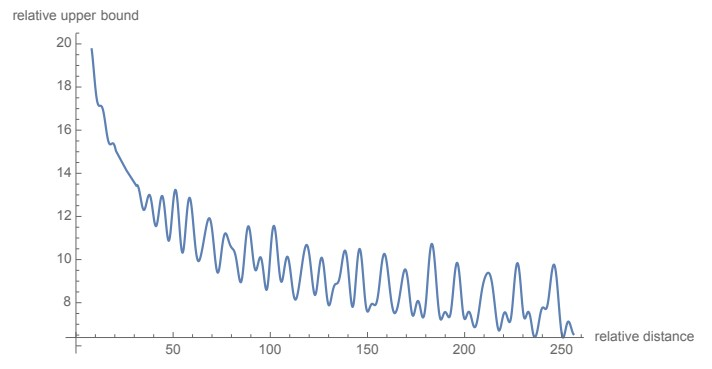

# 0 position embedding 概述
&nbsp;&nbsp;&nbsp;&nbsp;&nbsp;&nbsp;&nbsp;&nbsp;不同于RNN、CNN等模型，对于Transformer模型来说，位置编码的加入是必不可少的，因为纯粹的Attention模块是无法捕捉**输入顺序**的，即无法区分不同位置的Token。为此我们大体有两个选择：<br>
1. 想办法将位置信息融入到输入中，这构成了绝对位置编码的一般做法；<br>
2. 想办法微调一下Attention结构，使得它有能力分辨不同位置的Token，这构成了相对位置编码的一般做法。<br>

# 1 绝对位置编码
&nbsp;&nbsp;&nbsp;&nbsp;&nbsp;&nbsp;&nbsp;&nbsp;一般来说，绝对位置编码会加到输入中：在输入的第 k 个向量  $x_{k}$ 中加入位置向量  $p_{k}$  变为  $x_{k} + p_{k}$ ，其中  $p_{k}$ 只依赖于位置编号k. <br>

- 绝对位置编码公式表达如下：<br>


## 1.1 三角函数式(Sinusoidal)位置编码
&nbsp;&nbsp;&nbsp;&nbsp;&nbsp;&nbsp;&nbsp;&nbsp;三角函数式(Sinusoidal)位置编码是在原 [Transformer论文](https://arxiv.org/abs/1706.03762) 中使用的一种显式编码。<br>

$$p_{k, 2i} = sin (\frac{k}{10000^{2 i / d}})$$

$$p_{k, 2i+1} = cos (\frac{k}{10000^{2 i / d}})$$

其中 $p_{k, 2 i}, p_{k, 2 i+1}$ 分别是位置 k 的编码向量的第 $2i, 2i+1$  个分量， d 是位置向量的维度。<br>

&nbsp;&nbsp;&nbsp;&nbsp;&nbsp;&nbsp;&nbsp;&nbsp;固定维度d为500，绘制不同N下的position embedding，具体如下：<br>


- 示例：<br>


&nbsp;&nbsp;&nbsp;&nbsp;&nbsp;&nbsp;&nbsp;&nbsp;可以看到随着N的增大，周期会明显变长。文章中的N为10000，作者没有具体的解释，猜测可能是为了能让周期是一个很大的数，更好的区分开每个位置。<br>

## 3.2 可学习(Learnable)的位置编码
&nbsp;&nbsp;&nbsp;&nbsp;&nbsp;&nbsp;&nbsp;&nbsp;很显然，绝对位置编码的一个最朴素方案是不特意去设计什么，而是直接将位置编码当作可训练参数，比如最大长度为512，编码维度为768，那么就初始化一个512×768的矩阵作为位置向量，让它随着训练过程更新。现在的BERT、GPT等模型所用的就是这种位置编码.<br>

&nbsp;&nbsp;&nbsp;&nbsp;&nbsp;&nbsp;&nbsp;&nbsp;对于这种训练式的绝对位置编码，一般的认为它的缺点是没有外推性，即如果预训练最大长度为512的话，那么最多就只能处理长度为512的句子，再长就处理不了了。当然，也可以将超过512的位置向量随机初始化，然后继续微调。<br>

&nbsp;&nbsp;&nbsp;&nbsp;&nbsp;&nbsp;&nbsp;&nbsp;风极一时的 [bert](https://arxiv.org/abs/1810.04805) 中采用的就是这种编码方式，如下图所示：<br>


## 3.3 绝对位置编码的缺点
&nbsp;&nbsp;&nbsp;&nbsp;&nbsp;&nbsp;&nbsp;&nbsp;绝对位置编码为每个位置分配一个固定的编码值（如Transformer中的正弦/余弦函数），但它存在以下问题：

- **长度泛化能力差**：绝对位置编码在训练时固定了最大序列长度，当推理时遇到更长的序列时，模型可能无法正确处理。

- **位置关系建模不足**：绝对位置编码只关注每个位置的独立信息，而**忽略了位置之间的相对关系（如距离、方向等）**，这对于许多任务（如翻译、文本生成）至关重要。

- **对局部依赖不敏感**：绝对位置编码**无法直接建模相邻位置的依赖关系，而相对位置编码可以更好地捕捉局部上下文**。

# 2 相对位置编码
&nbsp;&nbsp;&nbsp;&nbsp;&nbsp;&nbsp;&nbsp;&nbsp;相对位置并没有完整建模每个输入的位置信息，而是在算Attention的时候考虑当前位置与被Attention的位置的相对距离，由于自然语言一般更依赖于相对位置，所以相对位置编码通常也有着优秀的表现。对于相对位置编码来说，它的灵活性更大，更加体现出了研究人员的“天马行空”。<br>

## 2.1 相对位置编码的优势
- 更好的长度泛化能力：相对位置编码**不依赖于固定的序列长度**，能够处理比训练时更长的序列。<br>
- 捕捉局部和全局依赖：相对位置编码能够同时建模局部（如相邻词）和全局（如远距离词）的依赖关系。<br>
- 任务适应性更强：在许多任务中（如机器翻译、文本生成），相对位置关系比绝对位置更重要。例如，句子中的词序关系（如主语-谓语）通常与绝对位置无关。<br>
- 计算效率更高：相对位置编码可以通过矩阵运算高效实现，减少了计算复杂度。<br>

## 2.2 经典的相对位置编码
&nbsp;&nbsp;&nbsp;&nbsp;&nbsp;&nbsp;&nbsp;&nbsp;相对位置编码起源于Google的论文[《Self-Attention with Relative Position Representations》](https://arxiv.org/abs/1803.02155)，一般认为，相对位置编码是由绝对位置编码启发而来，我们再回忆下一般的带绝对位置编码的Attention：<br>


&nbsp;&nbsp;&nbsp;&nbsp;&nbsp;&nbsp;&nbsp;&nbsp;其中 softmax 对 j 那一维归一化，这里的向量都是指行向量。我们初步展开 $q_{i}k_{j}^{\top}$ . <br>


&nbsp;&nbsp;&nbsp;&nbsp;&nbsp;&nbsp;&nbsp;&nbsp;为了引入相对位置信息，Google把第一项位置去掉，第二项 $p_{j} W_{K}$ 改为二元位置向量 $R_{i, j}^{K}$ . 变成： <br>

$$a_{i, j}=softmax(x_{i} W_{Q}(x_{j} W_{K}+R_{i, j}^{K})^{\top})$$

以及 $o_{i}=\sum_{j} a_{i, j} v_{j} = \sum_{j} a_{i, j}(x_{j} W_{V}+p_{j} W_{V})$ 中的 $p_{j} W_{V}$ 换成 $R_{i, j}^{V}$ : <br>

$$o_{i}=\sum_{j} a_{i, j}(x_{j} W_{V}+R_{i, j}^{V})$$

&nbsp;&nbsp;&nbsp;&nbsp;&nbsp;&nbsp;&nbsp;&nbsp;所谓相对位置，是将本来依赖于二元坐标  (i, j)  的向量  $R_{i, j}^{K}, R_{i, j}^{V}$ ，改为只依赖于相对距离  i-j，并且通常来说会进行截断，以适应不同任意的距离: <br>

$$R_{i, j}^{K}=p_{K}[clip(i-j, p_{\min }, p_{\max })]$$

$$R_{i, j}^{v}=p_{v}[clip(i-j, p_{\min }, p_{\max })]$$

&nbsp;&nbsp;&nbsp;&nbsp;&nbsp;&nbsp;&nbsp;&nbsp;这样一来，只需要有限个位置编码，就可以表达出任意长度的相对位置（因为进行了截断），不管 $p_{K} ,p_{V}$ 是选择可训练式的还是三角函数式的，都可以达到处理任意长度文本的需求。<br>

## 2.3 T5 中的相对位置编码

&nbsp;&nbsp;&nbsp;&nbsp;&nbsp;&nbsp;&nbsp;&nbsp;T5模型出自文章[《Exploring the Limits of Transfer Learning with a Unified Text-to-Text Transformer》](https://arxiv.org/abs/1910.10683)，里边用到了一种更简单的相对位置编码。 <br>

&nbsp;&nbsp;&nbsp;&nbsp;&nbsp;&nbsp;&nbsp;&nbsp;将  $q_{i}k_{j}^{\top}$ 完全展开得到：<br>

$$q_{i} k_{j}^{\top}= x_{i} W_{Q} W_{K}^{\top} x_{j}^{\top}+x_{i} W_{Q} W_{K}^{\top} p_{j}^{\top}+p_{i} W_{Q} W_{K}^{\top} x_{j}^{\top}+p_{i} W_{Q} W_{K}^{\top} p_{j}^{\top}$$

&nbsp;&nbsp;&nbsp;&nbsp;&nbsp;&nbsp;&nbsp;&nbsp;上式每一项可以分别理解为“输入-输入”、“输入-位置”、“位置-输入”、“位置-位置”四项注意力的组合。如果我们认为输入信息与位置信息应该是独立（解耦）的，那么它们就不应该有过多的交互，所以“输入-位置”、“位置-输入”两项Attention可以删掉， $p_{i} W_{Q} W_{K}^{\top} p_{j}^{\top}$ 实际上只是一个只依赖于(i,j) 的标量，我们可以直接将它作为参数训练出来，即简化为: <br>

$$x_{i} W_{Q} W_{K}^{\top} x_{j}^{\top} + \beta_{i, j}$$

&nbsp;&nbsp;&nbsp;&nbsp;&nbsp;&nbsp;&nbsp;&nbsp;简而言之，它仅仅是在Attention矩阵的基础上加一个可训练的偏置项而已. <br>

&nbsp;&nbsp;&nbsp;&nbsp;&nbsp;&nbsp;&nbsp;&nbsp;比较“别致”的是，不同于常规位置编码对将 $\beta_{i, j}$  视为  i-j  的函数并进行截断的做法， **T5** 对相对位置进行了一个“分桶”处理，即相对位置是  i-j  的位置实际上对应的是  f(i-j)  位置，映射关系如下：<br>


&nbsp;&nbsp;&nbsp;&nbsp;&nbsp;&nbsp;&nbsp;&nbsp;具体的映射代码，读者自行看源码就好。这个设计的思路其实也很直观，就是比较邻近的位置（0～7），我们需要比较得精细一些，所以给它们都分配一个独立的位置编码，至于稍远的位置（比如8～11），我们不用区分得太清楚，所以它们可以共用一个位置编码，距离越远，共用的范围就可以越大，直到达到指定范围再clip。<br>

- [论文链接](https://arxiv.org/abs/1910.10683)

## 2.4 T5 中相对位置编码的实现
```python
import torch
from torch import nn

class T5RelativePositionBias(nn.Module):
    def __init__(self, num_heads, relative_attention_num_buckets=32):
        super().__init__()
        self.num_heads = num_heads
        self.relative_attention_num_buckets = relative_attention_num_buckets
        
        # 定义可学习的相对位置偏置参数
        self.relative_attention_bias = nn.Embedding(
            relative_attention_num_buckets, num_heads
        )

    def _relative_position_bucket(self, relative_position):
        """
        将相对位置映射到离散的桶(bucket)
        """
        num_buckets = self.relative_attention_num_buckets
        ret = 0
        
        # 处理正向和负向相对位置
        n = -relative_position
        n = torch.max(n, torch.zeros_like(n))
        
        # 分桶策略
        max_exact = num_buckets // 2
        is_small = n < max_exact
        
        val_if_large = max_exact + (
            torch.log(n.float() / max_exact) / 
            torch.log(torch.tensor(num_buckets / max_exact)) * 
            (num_buckets - max_exact)
        ).to(torch.long)
        
        val_if_large = torch.min(
            val_if_large, 
            torch.full_like(val_if_large, num_buckets - 1)
        )
        
        ret += torch.where(is_small, n, val_if_large)
        return ret

    def forward(self, query_len, key_len):
        """
        生成相对位置偏置矩阵
        Args:
            query_len: 查询序列长度
            key_len: 键序列长度
        Returns:
            bias: [num_heads, query_len, key_len]
        """
        # 生成相对位置矩阵
        context_position = torch.arange(query_len)[:, None]
        memory_position = torch.arange(key_len)[None, :]
        relative_position = memory_position - context_position
        
        # 映射到桶索引
        rp_bucket = self._relative_position_bucket(relative_position)
        
        # 查表获取偏置值
        values = self.relative_attention_bias(rp_bucket)
        values = values.permute([2, 0, 1])  # [heads, q_len, k_len]
        return values

class T5Attention(nn.Module):
    def __init__(self, d_model, num_heads):
        super().__init__()
        self.num_heads = num_heads
        self.d_head = d_model // num_heads
        
        # 初始化相对位置编码模块
        self.relative_position = T5RelativePositionBias(num_heads)
        
        # 初始化Q/K/V投影层
        self.q = nn.Linear(d_model, d_model)
        self.k = nn.Linear(d_model, d_model)
        self.v = nn.Linear(d_model, d_model)

    def forward(self, hidden_states):
        batch_size, seq_len, _ = hidden_states.shape
        
        # 计算Q/K/V
        q = self.q(hidden_states)  # [batch, seq, d_model]
        k = self.k(hidden_states)
        v = self.v(hidden_states)
        
        # 拆分多头
        q = q.view(batch_size, seq_len, self.num_heads, self.d_head).transpose(1, 2)
        k = k.view(batch_size, seq_len, self.num_heads, self.d_head).transpose(1, 2)
        v = v.view(batch_size, seq_len, self.num_heads, self.d_head).transpose(1, 2)
        
        # 计算注意力分数
        scores = torch.matmul(q, k.transpose(-1, -2)) / math.sqrt(self.d_head)
        
        # 添加相对位置偏置
        rel_pos_bias = self.relative_position(seq_len, seq_len)
        scores += rel_pos_bias
        
        # 计算注意力权重
        attn_weights = torch.softmax(scores, dim=-1)
        
        # 应用注意力到V
        context = torch.matmul(attn_weights, v)
        context = context.transpose(1, 2).reshape(batch_size, seq_len, -1)
        return context
```


# 3 旋转位置编码
[论文链接-EN](https://link.zhihu.com/?target=https%3A//arxiv.org/pdf/2104.09864.pdf)

[论文链接-CN](https://yiyibooks.cn/arxiv/2104.09864v5/index.html)

&nbsp;&nbsp;&nbsp;&nbsp;&nbsp;&nbsp;&nbsp;&nbsp;旋转位置编码（Rotary Position Embedding，RoPE）是论文 Roformer: Enhanced Transformer With Rotray Position Embedding 提出的一种能够将相对位置信息依赖集成到 self-attention 中并提升 transformer 架构性能的位置编码方式。而目前很火的 LLaMA、GLM 模型也是采用该位置编码方式。和相对位置编码相比，RoPE 具有更好的外推性，目前是大模型相对位置编码中应用最广的方式之一。<br>

**思考：什么是大模型外推性？** <br>

&nbsp;&nbsp;&nbsp;&nbsp;&nbsp;&nbsp;&nbsp;&nbsp;外推性是指大模型在训练时和预测时的输入长度不一致，导致模型的泛化能力下降的问题。例如，如果一个模型在训练时只使用了 512 个 token 的文本，那么在预测时如果输入超过 512 个 token，模型可能无法正确处理。这就限制了大模型在处理长文本或多轮对话等任务时的效果。<br>

## 3.1 RoPE 原理
&nbsp;&nbsp;&nbsp;&nbsp;&nbsp;&nbsp;&nbsp;&nbsp;RoPE 论文中指出，为了能利用上token的相对位置信息，假定 query 向量 $q_{m}$  和 key 向量 $k_{n}$ 之间的内积操作可以被一个函数 g 表示，该函数 g 的输入是词嵌入向量 $x_{m}, x_{n}$ ， 和它们之间的相对位置 m - n：<br>

$$\langle f_{q}(x_{m}, m), f_{k}(x_{n}, n)\rangle = g(x_{m}, x_{n}, m-n)$$

&nbsp;&nbsp;&nbsp;&nbsp;&nbsp;&nbsp;&nbsp;&nbsp;接下来的目标就是找到一个等价的位置编码方式，从而使得上述关系成立。假定现在词嵌入向量的维度是两维，这样就可以利用 **2 维度平面上的向量的几何性质**，然后论文中提出了一个满足上述关系的 f 和 g 的形式如下：<br>


&nbsp;&nbsp;&nbsp;&nbsp;&nbsp;&nbsp;&nbsp;&nbsp;这里面 Re 表示复数的实部。<br>

进一步地， $f_{g}$ 可以表示成下面的式子：<br>


同理， $f_{k}$ 表示成下面的式子：<br>


&nbsp;&nbsp;&nbsp;&nbsp;&nbsp;&nbsp;&nbsp;&nbsp;看到这里会发现，这不就是向量乘以了一个旋转矩阵吗？**这就是为什么叫做旋转位置编码的原因。** <br>

&nbsp;&nbsp;&nbsp;&nbsp;&nbsp;&nbsp;&nbsp;&nbsp;最终 $g(x_{m}, x_{n}, m-n)$ 可以表示如下：<br>


## 3.2 旋转矩阵的如何得到的呢？
&nbsp;&nbsp;&nbsp;&nbsp;&nbsp;&nbsp;&nbsp;&nbsp;旋转矩阵可以从复数指数形式 $e^{i\theta}$ 推导得到，这一过程紧密依赖于欧拉公式。欧拉公式表明对于任意实数 $\theta$，有：

$$ e^{i\theta} = \cos(\theta) + i\sin(\theta) $$

&nbsp;&nbsp;&nbsp;&nbsp;&nbsp;&nbsp;&nbsp;&nbsp;这里，$i$ 是虚数单位，满足 $i^2 = -1$。

&nbsp;&nbsp;&nbsp;&nbsp;&nbsp;&nbsp;&nbsp;&nbsp; **从 $e^{i\theta}$ 到旋转矩阵**<br>

&nbsp;&nbsp;&nbsp;&nbsp;&nbsp;&nbsp;&nbsp;&nbsp;在二维平面上，考虑一个点由复数 $z = x + iy$ 表示，其中 $x, y$ 分别是该点的实部和虚部坐标。如果我们要将这个点绕原点逆时针旋转一个角度 $\theta$，可以将其视为乘以 $e^{i\theta}$ 的过程。即，新的位置 $z'$ 可以通过以下操作得到：

$$ z' = z \cdot e^{i\theta} = (x + iy)(\cos(\theta) + i\sin(\theta)) $$

&nbsp;&nbsp;&nbsp;&nbsp;&nbsp;&nbsp;&nbsp;&nbsp;展开上述乘积，并利用 $i^2 = -1$，我们得到：

$ z' = x\cos(\theta) - y\sin(\theta) + i(x\sin(\theta) + y\cos(\theta)) $

&nbsp;&nbsp;&nbsp;&nbsp;&nbsp;&nbsp;&nbsp;&nbsp;这意味着新位置的实部和虚部分别为：

- 实部：$x' = x\cos(\theta) - y\sin(\theta)$
- 虚部：$y' = x\sin(\theta) + y\cos(\theta)$

&nbsp;&nbsp;&nbsp;&nbsp;&nbsp;&nbsp;&nbsp;&nbsp;如果我们用矩阵表示这个变换，就可以将上述方程组写成矩阵形式：

$$ \begin{bmatrix} x' \\ y' \end{bmatrix} = \begin{bmatrix} \cos(\theta) & -\sin(\theta) \\ \sin(\theta) & \cos(\theta) \end{bmatrix} \begin{bmatrix} x \\ y \end{bmatrix} $$

&nbsp;&nbsp;&nbsp;&nbsp;&nbsp;&nbsp;&nbsp;&nbsp;因此，我们得到了用于描述二维平面内绕原点逆时针旋转角度 $\theta$ 的旋转矩阵：

$$ R(\theta) = \begin{bmatrix} \cos(\theta) & -\sin(\theta) \\ \sin(\theta) & \cos(\theta) \end{bmatrix} $$

&nbsp;&nbsp;&nbsp;&nbsp;&nbsp;&nbsp;&nbsp;&nbsp;这便是从复数指数 $e^{i\theta}$ 到旋转矩阵的推导过程，展示了如何使用欧拉公式将复数运算与几何变换联系起来。这种关系在很多领域中都非常重要，包括物理学、工程学以及计算机图形学等。

## 3.3 2 维扩展到多维
&nbsp;&nbsp;&nbsp;&nbsp;&nbsp;&nbsp;&nbsp;&nbsp; 实际中 embedding 维度 都是多维的，将2维推广到任意维度，可以表示如下：<br>

$$f_{q, k}(x_{m}, m)=R_{\Theta, m}^{d} W_{q, k} x_{m}$$

&nbsp;&nbsp;&nbsp;&nbsp;&nbsp;&nbsp;&nbsp;&nbsp; 内积满足线性叠加性，因此任意偶数维的 RoPE，我们都可以表示为二维情形的拼接，即<br>


- 其中 <br>
$$\Theta=\left\lbrace \theta_{i}=10000^{-2(i-1) / d}, i \in[1,2, \ldots, d / 2]\right\rbrace$$

&nbsp;&nbsp;&nbsp;&nbsp;&nbsp;&nbsp;&nbsp;&nbsp;将 RoPE 应用到前面公式 g 的 Self-Attention 计算，可以得到包含相对位置信息的 Self-Attetion：<br>

$$q_{m}^{\top} k_{n}=(R_{\Theta, m}^{d} W_{q} x_{m})^{\top}(R_{\Theta, n}^{d} W_{k} x_{n})=x_{m}^{\top} W_{q} R_{\Theta, n-m}^{d} W_{k} x_{n}$$

&nbsp;&nbsp;&nbsp;&nbsp;&nbsp;&nbsp;&nbsp;&nbsp;值得指出的是，由于 $R_{\Theta}^{d}$ 是一个正交矩阵，它不会改变向量的模长，因此通常来说它不会改变原模型的稳定性。<br>

### 3.3.3 RoPE 的高效计算
&nbsp;&nbsp;&nbsp;&nbsp;&nbsp;&nbsp;&nbsp;&nbsp;由于  $R_{\Theta, m}^{d}$  的稀疏性，所以直接用矩阵乘法来实现会很浪费算力，推荐通过下述方式来实现 RoPE: <br>


*m是当前token的位置（如第1个token、第2个token等）*

&nbsp;&nbsp;&nbsp;&nbsp;&nbsp;&nbsp;&nbsp;&nbsp;其中， $\otimes$ 逐位对应相乘，即计算框架中的  运算。从这个实现也可以看到，RoPE 可以视为是乘性位置编码的变体。总结来说，RoPE 的 self-attention 操作的流程是：对于 token 序列中的每个词嵌入向量，首先计算其对应的 query 和 key 向量，然后对每个 token 位置都计算对应的旋转位置编码，接着对每个 token 位置的 query 和 key 向量的元素按照两两一组应用旋转变换，最后再计算 query 和 key 之间的内积得到 self-attention 的计算结果。具体过程可展示如下：<br>



&nbsp;&nbsp;&nbsp;&nbsp;&nbsp;&nbsp;&nbsp;&nbsp;可以看到，RoPE 形式上和前面公式 Sinusoidal 位置编码有点相似，只不过 Sinusoidal 位置编码是加性的，而 RoPE 可以视为乘性的。在  $\theta_{i}$  的选择上，RoPE 同样沿用了 Sinusoidal 位置编码的方案，即  
 $\theta_{i}=10000^{-2 i / d}$  (d 就是 dimension) ，它可以带来一定的远程衰减性。<br>



&nbsp;&nbsp;&nbsp;&nbsp;&nbsp;&nbsp;&nbsp;&nbsp;从图中我们可以看到随着相对距离的变大，内积结果有衰减趋势的出现。因此，选择  $\theta_{i}=10000^{-2 i / d}$ ，确实能带来一定的远程衰减性。论文中还试过以  $\theta_{i}=10000^{-2 i / d}$  为初始化，将 $\theta_{i}$  视为可训练参数，然后训练一段时间后发现  $\theta_{i}$  并没有显著更新，因此干脆就直接固定  $\theta_{i}=10000^{-2 i / d}$  了。<br>

## 3.4 RoPE 与经典位置编码的对比

| 编码类型       | 参数数量 | 长度外推 | 计算复杂度 | 相对位置建模 |
|----------------|----------|----------|------------|--------------|
| 绝对位置编码   | \( O(d) \) | 差       | \( O(1) \) | 隐式         |
| 相对位置编码   | \( O(L) \) | 中等     | \( O(L) \) | 显式（分桶） |
| 旋转位置编码   | **0**    | **优**   | \( O(1) \) | **显式（连续）** |


## 3.5 llama 中的RoPE 代码实现
```python
# 生成旋转矩阵
def precompute_freqs_cis(dim: int, seq_len: int, theta: float = 10000.0):
    # 计算词向量元素两两分组之后，每组元素对应的旋转角度\theta_i
    freqs = 1.0 / (theta ** (torch.arange(0, dim, 2)[: (dim // 2)].float() / dim))
    # 生成 token 序列索引 t = [0, 1,..., seq_len-1]
    t = torch.arange(seq_len, device=freqs.device)
    # freqs.shape = [seq_len, dim // 2] 
    freqs = torch.outer(t, freqs).float()  # 计算m * \theta

    # 计算结果是个复数向量
    # 假设 freqs = [x, y]
    # 则 freqs_cis = [cos(x) + sin(x)i, cos(y) + sin(y)i]
    freqs_cis = torch.polar(torch.ones_like(freqs), freqs) 
    return freqs_cis

# 旋转位置编码计算
def apply_rotary_emb(
    xq: torch.Tensor,
    xk: torch.Tensor,
    freqs_cis: torch.Tensor,
) -> Tuple[torch.Tensor, torch.Tensor]:
    # xq.shape = [batch_size, seq_len, dim]
    # xq_.shape = [batch_size, seq_len, dim // 2, 2]
    xq_ = xq.float().reshape(*xq.shape[:-1], -1, 2)
    xk_ = xk.float().reshape(*xk.shape[:-1], -1, 2)

    # 转为复数域
    xq_ = torch.view_as_complex(xq_)
    xk_ = torch.view_as_complex(xk_)

    # 应用旋转操作，然后将结果转回实数域
    # xq_out.shape = [batch_size, seq_len, dim]
    xq_out = torch.view_as_real(xq_ * freqs_cis).flatten(2)
    xk_out = torch.view_as_real(xk_ * freqs_cis).flatten(2)
    return xq_out.type_as(xq), xk_out.type_as(xk)

class Attention(nn.Module):
    def __init__(self, args: ModelArgs):
        super().__init__()

        self.wq = Linear(...)
        self.wk = Linear(...)
        self.wv = Linear(...)

        self.freqs_cis = precompute_freqs_cis(dim, max_seq_len * 2)

    def forward(self, x: torch.Tensor):
        bsz, seqlen, _ = x.shape
        xq, xk, xv = self.wq(x), self.wk(x), self.wv(x)

        xq = xq.view(batch_size, seq_len, dim)
        xk = xk.view(batch_size, seq_len, dim)
        xv = xv.view(batch_size, seq_len, dim)

        # attention 操作之前，应用旋转位置编码
        xq, xk = apply_rotary_emb(xq, xk, freqs_cis=freqs_cis)

        # scores.shape = (bs, seqlen, seqlen)
        scores = torch.matmul(xq, xk.transpose(1, 2)) / math.sqrt(dim)
        scores = F.softmax(scores.float(), dim=-1)
        output = torch.matmul(scores, xv)  # (batch_size, seq_len, dim)
  # ......
```

- [参考链接](https://hub.baai.ac.cn/view/29979)

# 4 YaRN: Yet another RoPE extensioN

- [论文地址](https://openreview.net/pdf?id=wHBfxhZu1u)
- [论文地址](https://arxiv.org/pdf/2309.00071)


## 4.1. 理论基础：RoPE的调整公式

YaRN的核心是对RoPE（Rotary Position Embedding）的**旋转角频率**进行动态调整。原始RoPE的旋转角频率公式为：
\[ \theta_i = base^{-2i/d} \]

*其中，`base` 是预定义的常数（如LLaMA的`base`=10000），`d` 是注意力头的维度。*

YaRN引入温度缩放因子（Temperature Scaling）和长度缩放因子（Scaling Factor），修改后的旋转角频率为：
\[ \theta'_i = \theta_i \left( \frac{L'}{L} \right)^{t/s} \]

- `L`：原始最大上下文长度（如4096）。
- `L'`：目标扩展长度（如32768）。
- `t`：温度参数（通常设为0.1到0.3）。
- `s`：衰减系数（控制高频和低频的平衡，通常为维度相关的值）。

## 4.2 位置信息调整
1. **动态调整基频**  
   根据目标长度 $ L' $ 和温度 $ t $，重新计算旋转角频率 $ \theta'_i $，避免直接外推导致的高频震荡。

2. **插值位置索引**  
   对位置索引 $ m $ 进行非线性插值（而非PI的线性插值）：  
   $$
   m' = m \cdot \left( \frac{L}{L'} \right)^\gamma
   $$

   - $ \gamma $ 是插值强度参数（通常接近1.0），确保位置编码平滑过渡。

## 4.3 渐进式微调（Progressive Fine-tuning）

1. 分阶段扩展：

- 初始阶段：用原始长度（如4k）微调少量步骤，稳定模型。

- 中间阶段：逐步增加上下文窗口（如4k→8k→16k→32k），每阶段微调数百步。

- 最终阶段：在目标长度（如32k）上微调，使用长文本数据（如书籍、长对话）。

2. 数据混合：

- 短文本（原始长度）和长文本（目标长度）按比例混合（如80%长文本+20%短文本），避免模型遗忘短上下文能力。

## 4.4 example
以下是一个带具体数字的YaRN实施方案案例，以将LLaMA-2模型的上下文窗口从4k扩展到32k（8倍）为例，涵盖数学计算、微调步骤和超参数设置：<br>

### 4.4.1. 超参数设置

| 参数名称         | 符号   | 数值示例       | 说明                                   |
|------------------|--------|----------------|----------------------------------------|
| 原始最大长度     | $ L $ | 4096           | LLaMA-2的原始上下文限制               |
| 目标扩展长度     | $ L' $| 32768          | 扩展到32k tokens                      |
| 温度系数         | $ t $ | 0.25           | 控制高频衰减的强度                    |
| 衰减系数         | $ s $ | $ d/2 $       | 通常取注意力头维度的一半              |
| 插值强度         | $ \gamma $ | 0.8        | 位置索引插值的非线性强度              |
| 旋转基频（原始） | base   | 10000          | RoPE的初始基频                        |

### 4.4.2. 具体计算步骤

**步骤1：调整旋转角频率 $ \theta'_i $ :**

- 原始RoPE的角频率
$$
\theta_i = 10000^{-2i/128} \quad (\text{假设 } d=128)
$$

- YaRN调整后的角频率（对第 $ i=32 $ 维计算示例）：
$$
\theta'_{32} = \frac{10000^{-64/128}}{\left(\frac{32768}{4096}\right)^{0.25/64}} = \frac{0.01}{8^{0.0039}} \approx 0.0097
$$

- **对比：** 直接外推时 $ \theta_{32} $ 不变，导致高频震荡。

**步骤2：位置索引插值**

&nbsp;&nbsp;&nbsp;&nbsp;&nbsp;&nbsp;&nbsp;&nbsp;将 4k → 32k（扩展 8 倍），设 $ \gamma = 0.8 $。对于位置 $ m=30000 $（新序列中的位置）：

$$
m'_{\text{插值}} = 30000 \cdot \left(\frac{4096}{32768}\right)^{0.8} = 30000 \cdot 0.125^{0.8} \approx 30000 \cdot 0.209 \approx 6270
$$

- 解释：模型实际计算 RoPE 时，会“认为”位置 30000 相当于原始分布中的 6270，而非直接使用 30000。

- **对比直接外推：** <br>

| 方法             | 计算位置 $ m=30000 $ 时的 RoPE 输入       | 效果                                   |
|------------------|------------------------------------------|----------------------------------------|
| 直接外推         | $ m=30000 $                             | 高频震荡，注意力失效                   |
| 线性插值（PI）   | $ m'=30000/8=3750 $                     | 部分有效，但分布偏移明显               |
| YaRN非线性插值   | $ m' \approx 6270 $                     | 平滑过渡，保留相对位置关系             |

- **为什么需要非线性（γ < 1.0）**
  - 线性插值（$\gamma=1.0$）：  
    - 简单缩放（如 $ m'=m/8 $），但会导致近距离位置的区分度下降（例如位置 1 和 2 被压缩到 0.125 和 0.25，差异过小）。

  - 非线性插值（$\gamma=0.8$）：  
    - 保留近距离位置的精细差异（如前 100 个位置的相对关系几乎不变）。  
    - 远距离位置被更强压缩（如 $ 30000 \to 6270 $），避免高频信号丢失。

- **非线性再理解** <br>

&nbsp;&nbsp;&nbsp;&nbsp;&nbsp;&nbsp;&nbsp;&nbsp;原始位置分布: [0, 1, 2, ..., 4095]
&nbsp;&nbsp;&nbsp;&nbsp;&nbsp;&nbsp;&nbsp;&nbsp;目标位置分布: [0, 1, 2, ..., 32767]
&nbsp;&nbsp;&nbsp;&nbsp;&nbsp;&nbsp;&nbsp;&nbsp;插值映射效果：

| 目标位置 | 线性插值 (γ=1.0) | YaRN非线性插值 (γ=0.8) |
|----------|-------------------|------------------------|
| 100      | 12.5              | ~42                    |
| 1000     | 125               | ~209                   |
| 30000    | 3750              | ~6270                  |

**步骤三：渐进式微调计划（分阶段）**

| 阶段 | 上下文长度 | 微调步数 | 学习率  | 数据混合比例（长:短） | 目标                     |
|------|------------|----------|---------|------------------------|--------------------------|
| 1    | 4096       | 200      | 2e-5    | 0%:100%               | 稳定初始模型             |
| 2    | 8192       | 300      | 1.5e-5  | 30%:70%               | 初步适应中等长度         |
| 3    | 16384      | 400      | 1e-5    | 60%:40%               | 过渡到长上下文           |
| 4    | 32768      | 1000     | 5e-6    | 90%:10%               | 最终优化长文本性能       |

## 4.5 关键代码实现
```python
import torch

def yarn_rope_apply(q, k, pos, base=10000, scaling_factor=8, temperature=0.25, dim=128):
    # 计算调整后的theta_i
    theta = 1.0 / (base ** (torch.arange(0, dim, 2).float() / dim))
    theta = theta / (scaling_factor ** (temperature / (dim // 2)))  # 温度缩放
    
    # 位置插值（非线性）
    pos = pos * (1.0 / scaling_factor) ** 0.8  # gamma=0.8
    
    # 生成旋转矩阵
    freqs = torch.outer(pos, theta)
    emb = torch.cat((freqs, freqs), dim=-1)
    cos = torch.cos(emb)
    sin = torch.sin(emb)
    
    # 应用旋转
    q_rot = q * cos + torch.roll(q, shifts=1, dims=-1) * sin
    k_rot = k * cos + torch.roll(k, shifts=1, dims=-1) * sin
    return q_rot, k_rot

# 示例输入（batch_size=1, num_heads=32, seq_len=32768, head_dim=128）
q = torch.randn(1, 32, 32768, 128)
k = torch.randn(1, 32, 32768, 128)
pos = torch.arange(0, 32768).float()  # 位置索引 [0, 32767)
q_rot, k_rot = yarn_rope_apply(q, k, pos)
```
